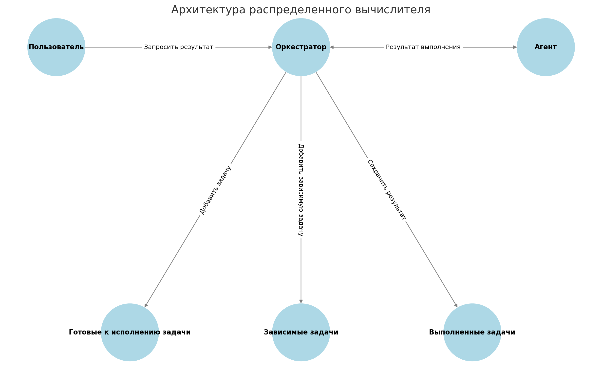

<!-- omit in toc -->
# Распределённый вычислитель арифметических выражений
- [Описание проекта](#описание-проекта)
- [Структура проекта](#структура-проекта)
- [Схема работы распределенного вычислителя](#схема-работы-распределенного-вычислителя)
- [Фронтенд: Веб-интерфейс](#фронтенд-веб-интерфейс)
- [Требования для запуска проекта](#требования-для-запуска-проекта)
- [Установка и запуск проекта](#установка-и-запуск-проекта)
- [Проверка работы приложения](#проверка-работы-приложения)
  - [1. Используя веб-интерфейс](#1-используя-веб-интерфейс)
  - [2. Отправляя HTTP-запросы к API Оркестратора](#2-отправляя-http-запросы-к-api-оркестратора)
- [Взаимодействие с API: примеры запросов](#взаимодействие-с-api-примеры-запросов)
  - [1. Добавление вычисления арифметического выражения](#1-добавление-вычисления-арифметического-выражения)
  - [2. Получение списка выражений](#2-получение-списка-выражений)
  - [3. Получение выражения по его идентификатору](#3-получение-выражения-по-его-идентификатору)
  - [4. Получение задачи для выполнения](#4-получение-задачи-для-выполнения)
  - [5. Прием результата обработки данных](#5-прием-результата-обработки-данных)
- [Логирование в проекте](#логирование-в-проекте)
  - [Формат логов](#формат-логов)
  - [Логи оркестратора и агента](#логи-оркестратора-и-агента)
- [Тестирование](#тестирование)
  - [Запуск тестов](#запуск-тестов)
  - [Что проверяют тесты](#что-проверяют-тесты)

## Описание проекта
Этот проект представляет собой распределенную систему для вычисления арифметических выражений, состоящую из оркестратора и агента. Система позволяет обрабатывать сложные арифметические выражения, разбивая их на отдельные операции, которые могут выполняться параллельно на разных вычислительных узлах.

Система состоит из ключевых компонентов: **Пользователя**, **Оркестратора** и **Агента**.

Пользователь отправляет выражение на вычисление в Оркестратор и запрашивает результат.
Оркестратор управляет процессом вычислений. Он разбирает выражение, создаёт задачи и распределяет их.
Готовые к исполнению задачи — задачи, которые могут быть сразу отправлены Агенту.
Зависимые задачи — задачи, выполнение которых зависит от результатов других операций.
Выполненные задачи — хранилище результатов завершенных вычислений.
Агент получает задачи от Оркестратора, выполняет вычисления и отправляет результаты обратно.
Оркестратор действует как центральный контроллер, управляя очередностью вычислений и взаимодействуя с Агентом. Пользователь взаимодействует только с Оркестратором, который скрывает внутреннюю логику обработки выражений.




## Структура проекта

```markdown
calculate_project

├── README.md                  # Описание проекта и инструкции
├── .env                       # Конфигурация
├── frontend                   # Фронтенд
│   ├── index.html             # Веб-страница с формой калькулятора
│   ├── style.css              # Стили
│   └──script.js               # Логика работы фронтенда
├── cmd                        # Исполняемые файлы
│   ├── agent                  # Код агента (вычислителя)
│   │   ├── main.go            # Точка входа для агента
│   │   └── main_test.go       # Тесты агента
│   └── orchestrator           # Код оркестратора (сервера)
│       ├── main.go            # Точка входа для оркестратора
│       └── main_test.go       # Тесты оркестратора
├── internal                   # Внутренняя логика приложения
│   ├── api                    # API-слой
│   │   ├── handlers.go        # Обработчики HTTP-запросов
│   │   ├── handlers_test.go   # Тесты обработчиков
│   │   ├── models.go          # Модели данных для API
│   │   └── server.go          # Настройка и запуск HTTP-сервера
│   └── application            # Бизнес-логика приложения
│       ├── application.go     # Основная логика работы с выражениями и задачами
│       └── application_test.go # Тесты бизнес-логики
└── pkg                        # Публичные пакеты
    └── calculation            # Пакет для вычисления выражений
        ├── calc.go            # Логика вычисления арифметических выражений
        ├── calc_test.go       # Тесты вычислений
        ├── errors.go          # Обработка ошибок
        └── validation.go      # Валидация выражений

```
  
## Схема работы распределенного вычислителя

**1. Инициализация:**

*   **Оркестратор:**
    *   Загружает конфигурацию из переменных окружения (время выполнения операций, порт).
    *   Создает структуры данных для хранения выражений, задач (очереди `taskQueue` и `dependentQueue`), и результатов задач (`taskResults`).  Использует мьютекс (`sync.Mutex`) для синхронизации доступа к этим структурам.
    *   Запускает HTTP-сервер, ожидающий запросы от пользователей и агентов.
*   **Агент:**
    *   Загружает конфигурацию из переменных окружения (URL оркестратора, количество вычислительных потоков `COMPUTING_POWER`).
    *   Создает пул горутин (воркеров), каждая из которых будет независимо запрашивать и выполнять задачи.  Количество воркеров определяется переменной `COMPUTING_POWER`.
    *   Каждый воркер в бесконечном цикле обращается к оркестратору.

**2.  Добавление выражения (от пользователя к оркестратору):**

1.  **Пользователь** отправляет HTTP POST-запрос на `/api/v1/calculate` оркестратора с телом запроса, содержащим арифметическое выражение в строковом формате (например, `{"expression": "2 + 2 * (3 - 1)"}`).
2.  **Оркестратор** (в обработчике `HandleCalculate`):
    *   Проверяет, что запрос является POST.
    *   Декодирует тело запроса в структуру `RequestAddExpression`.
    *   Вызывает функцию `ValidateExpression` для проверки корректности выражения (допустимые символы, баланс скобок, не пустое).  Если валидация не пройдена, возвращает HTTP-ответ с кодом 422 и описанием ошибки.
    *   Вызывает функцию `application.ParseExpression`, передавая ей строку с выражением.
    *   **`ParseExpression`**:
        1.  **Токенизация:**  Разбивает входную строку на токены (числа, операторы, скобки) с помощью функции `calculation.Tokenize`.
        2.  **Преобразование в постфиксную нотацию:**  Преобразует токены в постфиксную нотацию (обратную польскую запись) с помощью алгоритма сортировочной станции (функция `calculation.InfixToPostfix`).  Если обнаружены ошибки (например, несоответствие скобок), возвращается ошибка.
        3.  **Создание задач:**  Проходит по токенам в постфиксной записи.
            *   Если токен – число:
                *   Создает "задачу" (хотя фактически это уже вычисленное значение).
                *   Сохраняет значение в `taskResults` под уникальным ID задачи.
                *   Помещает ID задачи в стек.
            *   Если токен – оператор:
                *   Извлекает из стека ID двух последних задач (операндов).
                *   Создает новую задачу (`Task`) со статусом "pending".
                *   Заполняет поля `Operation`, `OperationTime` (на основе переменных окружения).
                *   Заполняет `ParentTasks`, указывая ID извлеченных из стека задач.
                *   Проверяет, есть ли уже результаты для родительских задач в `taskResults`. Если есть, сразу заполняет `Arg1` и `Arg2` задачи.
                *   Если оба аргумента (`Arg1` и `Arg2`) заполнены, помечает задачу как готовую (`IsReady = true`) и добавляет ее в очередь готовых задач `taskQueue`.
                *   Если хотя бы один аргумент не заполнен, добавляет задачу в очередь зависимых задач `dependentQueue`.
                *   Добавляет ID созданной задачи в стек.
        4.  Создает объект `Expression`, сохраняет в него исходное выражение, список созданных задач и присваивает ему статус "pending".
        5.  Сохраняет `Expression` в мапе `expressions` по уникальному ID выражения.
        6.  Возвращает ID выражения в обработчик `HandleCalculate`.
    *   Обработчик `HandleCalculate` возвращает пользователю HTTP-ответ с кодом 201 и телом, содержащим ID выражения (например, `{"id": 123}`).

**3.  Выполнение задач (агент запрашивает задачу у оркестратора):**

1.  **Агент** (внутри горутины-воркера) отправляет HTTP GET-запрос на `/internal/task` оркестратора.
2.  **Оркестратор** (в обработчике `HandleGetTask`):
    *   Вызывает функцию `application.GetNextTask`.
    *   **`GetNextTask`**:
        *   Проверяет, есть ли задачи в очереди `taskQueue`.
        *   Если очередь пуста, возвращает `nil, nil`.
        *   Если есть готовая задача, извлекает её из очереди `taskQueue` и возвращает.
    *   Если `GetNextTask` вернула `nil`, обработчик `HandleGetTask` возвращает агенту HTTP-ответ с кодом 404.
    *   Если задача получена, обработчик `HandleGetTask` формирует ответ (`ResponseGetTask`), содержащий информацию о задаче (ID, операцию, аргументы, время выполнения), и отправляет его агенту с кодом 200.

**4.  Выполнение задачи агентом:**

1.  **Агент** (внутри горутины-воркера):
    *   Получает HTTP-ответ от оркестратора.
    *   Декодирует тело ответа в структуру `Task`.
    *   Имитирует выполнение задачи, ожидая указанное в `OperationTime` время (используя `time.Sleep`).
    *   Вызывает функцию `performOperation`, передавая ей аргументы и операцию из задачи.
    *   **`performOperation`**:
        *   Выполняет математическую операцию (+, -, \*, /) над аргументами.
        *   Проверяет деление на ноль.
        *   Возвращает результат или ошибку.
    *   Формирует тело запроса (`RequestPostTask`), содержащее ID задачи и результат вычисления.
    *   Отправляет HTTP POST-запрос на `/internal/task` оркестратора с результатом.

**5.  Прием результата (оркестратор получает результат от агента):**

1.  **Оркестратор** (в обработчике `HandlePostTask`):
    *   Декодирует тело запроса в структуру `RequestPostTask`.
    *   Проверяет наличие ID задачи.
    *   Вызывает функцию `application.CompleteTask`, передавая ей ID задачи и результат.
    *   **`CompleteTask`**:
        *   Сохраняет результат выполнения задачи в `taskResults` по ID задачи.
        *   Ищет задачу в списке задач всех выражений (`expressions`).
        *   Если задача найдена, обновляет её статус на "completed" и сохраняет результат.
        *   Проверяет, завершены ли все задачи в выражении. Если да, вычисляет итоговый результат выражения (результат последней выполненной задачи) и устанавливает статус выражения в "completed".
        *   Обновляет очередь зависимых задач (`dependentQueue`):
            *   Проходит по всем задачам в `dependentQueue`.
            *   Для каждой задачи проверяет, выполнены ли все её родительские задачи (проверяет наличие результатов в `taskResults`).
            *   Если все родительские задачи выполнены, подставляет их результаты в `Arg1` и `Arg2` текущей задачи, помечает задачу как готовую (`IsReady = true`) и перемещает её из `dependentQueue` в `taskQueue`.
            *   Задачи, для которых не все родительские задачи выполнены, остаются в `dependentQueue`.
        *   Если задача не найдена, возвращает ошибку.
    *   Обработчик `HandlePostTask` возвращает агенту HTTP-ответ с кодом 200.

2.  **Оркестратор** (в обработчике `HandleGetExpressionByID`):
    *   Извлекает ID выражения из URL.
    *   Вызывает функцию `application.GetExpressionByID`, передавая ей ID.
    *   **`GetExpressionByID`**:
        *   Ищет выражение в мапе `expressions` по ID.
        *   Если выражение не найдено, возвращает ошибку "expression not found".
        *   Если выражение найдено:
            *   Проверяет, все ли задачи в выражении выполнены.
            *   Если *не все* задачи выполнены, возвращает выражение с текущим статусом ("pending").
            *   Если *все* задачи выполнены, но статус выражения еще "pending", обновляет статус на "completed", устанавливает результат выражения (результат последней выполненной задачи) и возвращает обновленное выражение.
    *   Обработчик `HandleGetExpressionByID`:
        *   Если `GetExpressionByID` вернула ошибку "not found", возвращает пользователю HTTP-ответ с кодом 404.
        *   Если произошла другая ошибка, возвращает 500.
        *   Если выражение найдено, формирует ответ (`GetExpressionResponse`), содержащий ID, статус и результат выражения, и отправляет его пользователю с кодом 200.

**7. Получение списка выражений (от пользователя к оркестратору):**

1.  **Пользователь** отправляет HTTP GET-запрос на `/api/v1/expressions` оркестратора.
2.  **Оркестратор** (в обработчике `HandleExpressions`):
    *   Вызывает функцию `application.GetAllExpressions`.
    *   **`GetAllExpressions`**:
        *   Возвращает мапу `expressions` со всеми выражениями.
    *   Обработчик `HandleExpressions`:
        *   Формирует ответ (`ResponseGetExpressions`), содержащий список всех выражений (ID, статус, результат), и отправляет его пользователю с кодом 200.

**Ключевые моменты и структуры данных:**

*   **`expressions` (map[int]*Expression):**  Хранит все выражения, добавленные в систему.  Ключ – ID выражения, значение – указатель на структуру `Expression`.
*   **`taskToExpression` (map[int]int):**  Отображает ID задачи на ID выражения, которому она принадлежит.
*   **`taskQueue` ([]*Task):**  Очередь *готовых* к выполнению задач.  Задачи попадают сюда, если все их зависимости (родительские задачи) уже выполнены.
*   **`dependentQueue` ([]*Task):**  Очередь задач, которые *ожидают* выполнения своих родительских задач.  Как только родительские задачи выполняются, зависимые задачи перемещаются в `taskQueue`.
*   **`taskResults` (map[int]float64):**  Хранит результаты *выполненных* задач.  Ключ – ID задачи, значение – результат (число с плавающей точкой).
*   **`sync.Mutex`:**  Используется для синхронизации доступа к общим ресурсам (мапам и очередям) из разных горутин (обработчиков HTTP-запросов).
*   **Постфиксная нотация:**  Входное выражение преобразуется в постфиксную нотацию (обратную польскую запись) для упрощения вычислений и однозначного определения порядка операций.
*   **Имитация длительных вычислений:**  Агент использует `time.Sleep` с длительностью, заданной в переменных окружения (`TIME_..._MS`), чтобы имитировать реальные вычислительные затраты.

## Фронтенд: Веб-интерфейс
Проект включает **простой веб-интерфейс**, который позволяет:
- Ввести математическое выражение.
- Отправить его на сервер для вычисления.
- Получить и отобразить результат.
  
## Требования для запуска проекта

Перед запуском проекта убедитесь, что на вашем компьютере установлены:

- [Go 1.18+](https://golang.org/dl/) (для разработки и запуска проекта)
- [Git](https://git-scm.com/) (для клонирования репозитория)
- [curl](https://curl.se/) или [Postman](https://www.postman.com/) (для тестирования API)
- [Python 3](https://www.python.org/downloads/) (опционально, если хотите запустить фронтенд на локальном сервере)

Проект использует следующие внешние зависимости:
- [github.com/joho/godotenv](https://github.com/joho/godotenv) - для загрузки переменных окружения из файла .env


## Установка и запуск проекта

1. Клонируйте репозиторий на свой компьютер с GitHub с помощью команды:

```bash
git clone https://github.com/syirnik/GO_Yandex
```
2. Перейдите в каталог проекта
```bash
cd calculate_project
```
3. Установите все необходимые зависимости
```bash
go mod tidy
```
4. Настройка переменных окружения

Проект уже содержит файл .env со следующими настройками:

- `TIME_ADDITION_MS=5000`       # Время выполнения операции сложения (мс). Это время задержки, которое будет искусственно добавлено для имитации вычислительной нагрузки при выполнении операции сложения.
- `TIME_SUBTRACTION_MS=7000`    # Время выполнения операции вычитания (мс). Задержка для операции вычитания.
- `TIME_MULTIPLICATIONS_MS=10000` # Время выполнения операции умножения (мс). Задержка для операции умножения.
- `TIME_DIVISIONS_MS=15000`     # Время выполнения операции деления (мс). Задержка для операции деления.
- `PORT=8080`                   # Порт для запуска оркестратора. По умолчанию оркестратор будет слушать на порту 8080.
- `ORCHESTRATOR_URL=http://localhost:%s` # URL оркестратора для агентов. Этот параметр используется для подключения агентов к оркестратору.
- `COMPUTING_POWER=5`           # Количество вычислительных потоков для агента. Указывает, сколько агентов будет одновременно выполнять вычисления.

При необходимости вы можете изменить эти значения под свои требования.

5. Запуск оркестратора

```bash
go run cmd/orchestrator/main.go
```

После запуска оркестратор будет слушать на указанном в .env порту (по умолчанию 8080). В консоли появится сообщение:

```bash
Starting server on port :8080...
```

После того как сервер успешно запущен, он готов к приему запросов.

6. Запуск агента
   
Откройте новое окно терминала и выполните:

```bash
go run cmd/agent/main.go
```

После запуска агент выведет сообщение:

```console
Agent started with computing power: 5
Worker 1 started and waiting for tasks...
Worker 2 started and waiting for tasks...
Worker 3 started and waiting for tasks...
Worker 4 started and waiting for tasks...
Worker 5 started and waiting for tasks...
```

## Проверка работы приложения

Проверку работы системы можно проверить несколькими способами:

### 1. Используя веб-интерфейс 
   
Откройте файл `frontend/index.html` в браузере **или** запустите локальный сервер:

```sh
cd frontend
python -m http.server 8081
```

Перейдите в браузере по адресу http://localhost:8081.  
Веб-интерфейс позволяет ввести арифметическое выражение, отправить его на вычисление и увидеть результат.

**!!! Длительность вычислений**  

Так как вычисления выполняются **"очень-очень" долго**, согласно описанию задачи, пользователю следует учитывать, что статус **"Вычисляется..."** может оставаться активным в течение продолжительного времени.  

Это происходит потому что **агент выполняет операции с задержками**, которые задаются в файле `.env`. По умолчанию время выполнения операций следующее:  

  ```env
  TIME_ADDITION_MS=5000        # Сложение: 5 секунд
  TIME_SUBTRACTION_MS=7000     # Вычитание: 7 секунд
  TIME_MULTIPLICATIONS_MS=10000 # Умножение: 10 секунд
  TIME_DIVISIONS_MS=15000      # Деление: 15 секунд
```
Что означает, что сложные выражения, содержащие много операций, могут выполняться десятки секунд.  
Фронтенд запрашивает результат выражения каждые 3 секунды, используя 30 попыток, таким образом, браузер будет ожидать до 90 секунд, прежде чем сообщить пользователю, что результат не получен.  
Если вы не получили результат, используя веб-интерфейс, проверьте, не слишком ли сложное выражение. Если выражение содержит много операций, оно может выполняться дольше 90 секунд.

### 2. Отправляя HTTP-запросы к API Оркестратора

Это можно сделать в **терминале** с помощью команды **curl** или в **Postman** – удобном графическом инструменте для работы с API. Нужно создать новый запрос, выбрать метод (GET/POST) и передавать данные в формате JSON.

Ниже рассмотрим примеры запросов с помощью команды curl.

## Взаимодействие с API: примеры запросов

Откройте новое окно терминала и выполните запросы:

### 1. Добавление вычисления арифметического выражения
Пример запроса:
```bash
curl -s -i --location 'http://localhost:8080/api/v1/calculate' \
--header 'Content-Type: application/json' \
--data '{
  "expression": "2+2*3"
}'
```
Пример ответа:
```console
HTTP/1.1 201 Created
Content-Length: 9
Content-Type: text/plain; charset=utf-8

{"id":4}
```
Возможные коды ответа:
| Код | Описание |
|------|-----------------------------------------------|
| **201 Created** | Выражение принято для вычисления. Ответ содержит ID выражения. |
| **400 Bad Request** | Отсутствует поле `expression` в теле запроса. |
| **422 Unprocessable Entity** | Некорректные данные (например, `"expression": "2++2"`). |
| **500 Internal Server Error** | Ошибка на стороне сервера. |


### 2. Получение списка выражений
Пример запроса:
```bash
curl -s -i --location 'http://localhost:8080/api/v1/expressions'
```
Пример ответа:
```console
HTTP/1.1 200 OK
Content-Type: application/json
Content-Length: 415

{
  "expressions": [
    {"id": 4, "status": "pending", "result": 0},
    {"id": 5, "status": "completed", "result": 0},
    {"id": 9, "status": "completed", "result": -5.999999998},
    {"id": 3, "status": "completed", "result": 2.6666666666666665}
  ]
}
```
| Код | Описание |
|------|-----------------------------------------------|
| **200 OK** | Успешно получен список выражений. |
| **500 Internal Server Error** | Ошибка на стороне сервера


### 3. Получение выражения по его идентификатору
Пример запроса:
```bash
curl -s -i --location 'http://localhost:8080/api/v1/expressions/5'
```
Пример ответа:
```console
HTTP/1.1 200 OK
Content-Type: application/json
Content-Length: 56

{"expression":{"id":5,"status":"completed","result":0}}
```
| Код | Описание |
|------|-----------------------------------------------|
| **200 OK** | Успешно получено выражение. |
| **404 Not Found** | Выражение с указанным идентификатором не найдено. |
| **500 Internal Server Error** | Ошибка на стороне сервера. |

### 4. Получение задачи для выполнения
Для тестирования этого endpoint завершите работу агента, оставив запущенным только оркестратор. Затем отправьте запрос на выполнение выражения, чтобы оркестратор добавил его в очередь задач.

Пример запроса:
```bash
curl -s -i --location 'http://localhost:8080/api/v1/calculate' \
--header 'Content-Type: application/json' \
--data '{
  "expression": "2+8/4"
}'
```
Затем, получив ответ с успешным выполнением добавления выражения на вычисление:

```console
HTTP/1.1 201 Created
Date: Tue, 04 Mar 2025 10:39:28 GMT
Content-Length: 9
Content-Type: text/plain; charset=utf-8

{"id":1}
```
запустите запрос на получение задачи:

```bash
curl -s -i --location 'http://localhost:8080/internal/task'
```
Если ранее был отправлен запрос оркестратору на выполнение вычислений, но задача еще не была обработана, оркестратор вернет следующую задачу из очереди для выполнения.

Пример ответа:
```console
HTTP/1.1 200 OK
Content-Type: application/json
Content-Length: 75

{"task":{"id":4,"arg1":8,"arg2":4,"operation":"/","operation_time":15000}}

```
Если в системе нет ожидающих выполнения задач — либо все выражения уже вычислены, либо запросы на их выполнение не отправлялись — оркестратор вернет ответ:
```console
HTTP/1.1 404 Not Found
Content-Length: 0
```
| Код | Описание |
|------|-----------------------------------------------|
| **200 OK** | Успешно получена задача. |
| **404 Not Found** | Нет доступных задач. |
| **500 Internal Server Error** | Ошибка на стороне сервера. |


### 5. Прием результата обработки данных
Для проверки endpoint запомните  id задачи из предыдущего ответа, например "id":4, и введите запрос с этим id

Пример запроса:
```bash
curl -s -i --location 'localhost:8080/internal/task' --header 'Content-Type: application/json' --data '{
  "id": 4,
  "result": 2.5
}'
```
Пример ответа:
```console
HTTP/1.1 200 OK
Date: Tue, 04 Mar 2025 11:04:49 GMT
Content-Length: 0
```
Если введен номер несуществующей задачи, будет получен ответ
```console
curl -s -i --location 'localhost:8080/internal/task' --header 'Content-Type: application/json' --data '{
  "id": 47,
  "result": 2.5
}'
HTTP/1.1 404 Not Found
Content-Type: text/plain; charset=utf-8
X-Content-Type-Options: nosniff
Date: Tue, 04 Mar 2025 11:05:50 GMT
Content-Length: 26

task with ID 47 not found
```
Другие примеры невалидного id задачи:
```console
curl -s -i --location 'localhost:8080/internal/task' --header 'Content-Type: application/json' --data '{
  "id": а,
  "result": 2.5
}'
HTTP/1.1 422 Unprocessable Entity
Content-Type: text/plain; charset=utf-8
X-Content-Type-Options: nosniff
Date: Tue, 04 Mar 2025 11:07:17 GMT
Content-Length: 21

Invalid request body
```
| Код | Описание |
|------|------------------------------------------------------------|
| **200 OK** | Успешно записан результат. |
| **404 Not Found** | Нет такой задачи. |
| **422 Unprocessable Entity** | Невалидные данные в запросе, например: отсутствует поле `id` или `result`, `id` содержит некорректное значение (не число), `result` имеет неверный формат. |
| **500 Internal Server Error** | Ошибка на стороне сервера. |

## Логирование в проекте

Для отладки и мониторинга работы системы в проекте используется логирование событий. Логи позволяют отслеживать процесс вычисления выражений, взаимодействие между оркестратором и агентами, а также выявлять возможные ошибки.

### Формат логов

Каждое сообщение в логах содержит:  
- Временную метку (в формате YYYY/MM/DD HH:MM:SS).  
- Источник события (например, HandleCalculate, ParseExpression, CompleteTask).  
- Описание действия (что произошло, какие данные обработаны).  

Пример логов работы **оркестратора**:

```console
2025/03/04 14:00:13 HandleCalculate: Received request
2025/03/04 14:00:13 ValidateExpression: Validating expression: 2+8/4
2025/03/04 14:00:13 ParseExpression: Processing expression: 2+8/4
2025/03/04 14:00:13 Tokenize: Final tokens: [2 + 8 / 4]
2025/03/04 14:00:13 InfixToPostfix: Final postfix expression: [2 8 4 / +]
2025/03/04 14:00:13 ParseExpression: Created task for number 2 with ID 1
2025/03/04 14:00:13 GetNextTask: Issued task ID 4 to agent
2025/03/04 14:00:13 HandlePostTask: Successfully completed task ID 4
```
Пример логов работы **агента**:
```console
2025/03/04 13:59:11 ORCHESTRATOR_URL: http://localhost:8080
2025/03/04 13:59:11 Agent started with computing power: 5
2025/03/04 13:59:11 Worker 1 started and waiting for tasks...
2025/03/04 13:59:21 Worker 1 received task: ID=4, Operation=/, Arg1=8.00, Arg2=4.00, OperationTime=15000ms
2025/03/04 13:59:36 Worker 1 successfully sent result for task 4 to http://localhost:8080
```
### Логи оркестратора и агента
**Оркестратор** логирует следующие события:

- Приём выражений (HandleCalculate).
- Разбор и токенизация выражения (ParseExpression, Tokenize, InfixToPostfix).
- Cоздание и обработка задач (taskQueue, dependentQueue).
- Выдача задач агентам (HandleGetTask).
- Приём результатов от агентов (HandlePostTask, CompleteTask).
- Обнаруженные ошибки (например, task with ID 47 not found).

**Агент** логирует:

- Запуск и настройку (ORCHESTRATOR_URL, COMPUTING_POWER).  
- Запросы задач у оркестратора (GET /internal/task).  
- Получение задачи (Worker 1 received task: ID=4, Operation=/, Arg1=8.00, Arg2=4.00).  
- Выполнение вычисления (Sleeping for 15000ms to simulate computation).  
- Отправку результата обратно оркестратору (POST /internal/task).  

Благодаря логированию можно отследить работу системы на всех этапах – от разбора выражений и создания задач до их выполнения агентами и возврата результата.
Логи позволяют: прослеживать путь вычислений, видеть, как выражение разбивается на задачи, понимать, какие задачи выполняются в данный момент, и нет ли зависших вычислений, диагностировать ошибки в передаче данных между оркестратором и агентами, контролировать время выполнения операций, чтобы оптимизировать систему.


## Тестирование

Для написания тестов используется стандартная библиотека Go testing, которая предоставляет базовые функции для написания, выполнения и проверки результатов тестов.
Для проверки правильности работы кода можно использовать стандартный инструмент Go для тестирования — `go test`.

### Запуск тестов

1. Перейдите в корневую папку проекта
```bash
cd calculate_project
```
2. Запуск всех тестов
Чтобы запустить тесты, выполните следующую команду:

```bash
go test ./...
```
Эта команда выполнит все тесты во всех пакетах проекта, включая модули оркестратора, агентов, логики вычислений, а также API.

Пример ответа:
```console
ok      calculator_project/cmd/agent    1.049s
ok      calculator_project/cmd/orchestrator     0.585s
ok      calculator_project/internal/api 0.620s
ok      calculator_project/internal/application 0.473s
ok      calculator_project/pkg/calculation      0.262s
```

3. Запуск тестов для конкретного пакета
Если вам нужно запустить тесты только для конкретного пакета, например, для пакета с логикой вычислений, используйте команду:

```bash
go test ./pkg/calculation
```
Эта команда выполнит тесты только для пакета pkg/calculation.

4. Запуск тестов с выводом подробной информации
Если нужно увидеть детальный вывод тестов, добавьте флаг -v:
```bash
go test -v ./...
```

### Что проверяют тесты
Тесты в проекте проверяют правильность работы функций и алгоритмов, таких как:  
**Корректность вычислений арифметических выражений:**  
Проверка базовых операций (+, -, *, /).  
Обработка операторного приоритета (2 + 2 * 2 → 6).  
Проверка работы со скобками ((3 + 5) * 2 → 16).  
**Обработка ошибок:**  
Деление на ноль (1 / 0 → Ошибка).  
Некорректные выражения (2 + * 2 → Ошибка 422 "invalid expression").  
**Работа очереди задач в оркестраторе:**  
Проверка постановки задач в очередь (taskQueue).  
Проверка зависимых задач (dependentQueue).  
Проверка обработки готовых задач (taskResults).  
**Работа с агентами:**  
Получение задач агентами (GET /internal/task).  
Корректное выполнение вычислений с задержкой (time.Sleep).  
Отправка результатов (POST /internal/task).  
**API оркестратора:**  
Добавление выражений (POST /api/v1/calculate).  
Запрос списка выражений (GET /api/v1/expressions).  
Запрос выражения по ID (GET /api/v1/expressions/{id}).
